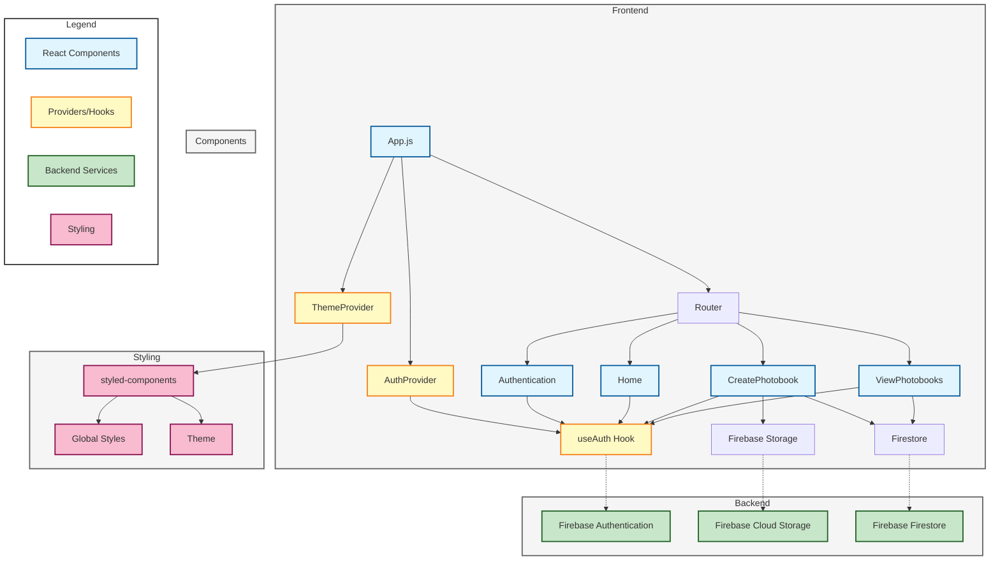

# Photobook App

## Overview

Photobook is a modern, React-based web application that allows users to create and manage digital photobooks. Users can upload photos, add metadata, and organize their memories in a sleek, user-friendly interface.


## Features

- Google Authentication
- Create up to 10 photobooks per user
- Add up to 20 photos per photobook
- Add metadata to photos (title, film stock, people, location, caption, event)
- View photobooks in a carousel layout

## Architecture

The Photobook app is built using React for the frontend and Firebase for backend services. Here's a high-level overview of the architecture :



## Component Structure

The app is composed of several key components:


## User Flow

The typical user flow in the Photobook app is as follows:


## Setup and Installation

1. Clone the repository:

   ```
   git clone https://github.com/yourusername/photobook-app.git
   ```

2. Install dependencies:

   ```
   cd photobook-app
   npm install
   ```

3. Set up Firebase:

   - Create a new Firebase project
   - Enable Authentication, Firestore, and Storage
   - Add your Firebase configuration to `.env` file:
     ```
     REACT_APP_FIREBASE_API_KEY=your_api_key
     REACT_APP_FIREBASE_AUTH_DOMAIN=your_auth_domain
     REACT_APP_FIREBASE_PROJECT_ID=your_project_id
     REACT_APP_FIREBASE_STORAGE_BUCKET=your_storage_bucket
     REACT_APP_FIREBASE_MESSAGING_SENDER_ID=your_messaging_sender_id
     REACT_APP_FIREBASE_APP_ID=your_app_id
     ```

4. Run the app:
   ```
   npm start
   ```

## Key Components

### CreatePhotobook

The CreatePhotobook component allows users to create a new photobook. It includes features like:

- Photo upload (max 20 photos)
- Metadata input for each photo
- Loading spinner during photobook creation


### ViewPhotobooks

The ViewPhotobooks component displays all photobooks created by the user. It includes:

- Carousel display of photos in each photobook
- Metadata display for each photo
- Create new photobook button (disabled if limit reached)


## Limitations and Future Enhancements

- Current limit: 10 photobooks per user, 20 photos per photobook
- Future enhancements may include:
  - Sharing photobooks with other users
  - Exporting photobooks as PDFs
  - Adding video support

## Contributing

Contributions are welcome! Please feel free to submit a Pull Request.

## License

This project is licensed under the MIT License.
